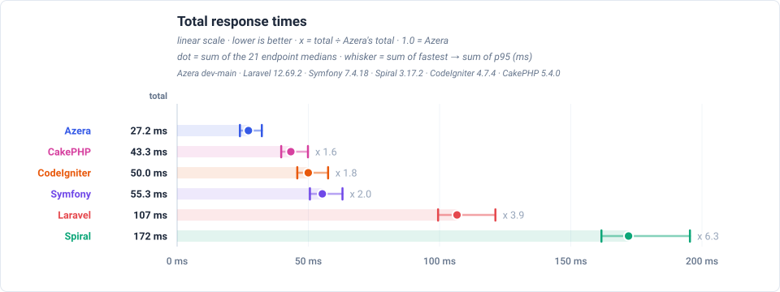
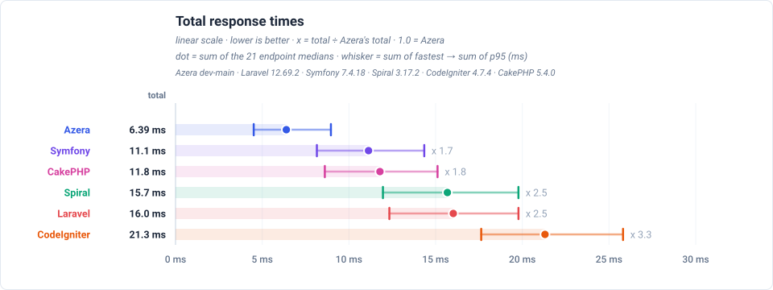

### Lightweight by Design. Powerful in Practice.

A lightweight, fast PHP framework for building modern Web applications and CLI tools. Azera combines the best ideas from frameworks like Phalcon, CodeIgniter, Laravel and Symfony into a minimal yet powerful toolkit.

## Why Azera?

**Lightweight & Fast** - Minimal dependencies and overhead. No bloat, just what you need.

**Modern PHP** - Built for PHP 8.2+, embracing type hints, named arguments, and modern patterns.

**Unified Query Builder** - One consistent, fluent API for all database operations, whether you're using models or raw queries.

**Flexible Architecture** - Use as much or as little as you need. Mix and match components freely.

**Secure by Default** - SQL injection protection via prepared statements, session-safe cookie encryption, and hardened defaults throughout.

**Developer Friendly** - Intuitive APIs, clear error messages, and comprehensive documentation.

## Features

### MVC Stack

- **Router** - Fast pattern matching with named routes, parameter validation, and middleware support
- **Controllers** - Clean action-based controllers with dependency injection
- **Dispatcher** - Flexible request dispatching with middleware pipeline
- **ViewEngine** - Clarity template engine with auto-escaping, template inheritance, and a filter pipeline. Other engines can be used as well, including Twig, Plates, and plain PHP templates.

### Database & ORM

- **Query Builder** - Unified fluent interface for SELECT, INSERT, UPDATE, DELETE
- **Active Record Models** - Expressive model API with state tracking and typed property support
- **Prepared Statements** - SQL injection protection by default
- **Read/Write Splitting** - Built-in support for master/replica database setups
- **Connection Pooling** - Automatic reconnection and connection management
- **Schema Introspection** - Introspect database schema for dynamic models and migrations

### HTTP Utilities

- **Request** - Normalized access to GET, POST, headers, and file uploads
- **Response** - Fluent response building with JSON, redirects, and status codes
- **Session** - Simple session management with pluggable storage handlers
- **Cookies** - Easy cookie handling with encryption support
- **Middleware** - Composable request/response filters

### CLI Tools

- **Console** - Powerful CLI dispatcher with:
  - Auto-discovery of tasks from namespaces
  - Flexible task grouping and custom namespaces
  - Rich color output and styled help pages
  - Option parsing and argument separation
  - Built-in help and task listing
- **ModelSync Task (`model-sync`)** - Built-in CLI task for synchronizing PHP models with the database schema, optionally applying changes and scaffolding new models.

### Additional Features

- **Validation** - Fluent field rules with type coercion, nested list/object validation, and error collection
- **Security** - CSRF middleware, rate limiting, password hashing, encryption (Sodium/OpenSSL)
- **Logging** - PSR-3 logging, typed PSR-14 database events
- **Pagination, AOP and queues** - Built-in pagination, attribute-driven interceptors, task queues

## Benchmarks

Azera is measured against Laravel, Symfony, Spiral, CodeIgniter 4 and CakePHP 5 on an identical full-stack workload — routing → controller → ORM query (SQLite) → template render → response — running on a real server. Two summaries are published beside the docs, one per deployment model:

**As nginx + PHP-FPM** — the framework boots again for every request, as PHP usually runs in production:



**As a resident worker (RoadRunner)** — the framework boots once and serves every request:



Each chart sums one pass over all 21 benchmarked endpoints. The full per-endpoint tables, the per-feature races and the memory charts are in the [PHP-FPM](docs/19-BENCHMARKS-SUMMARY-FPM.md) and [RoadRunner](docs/19-BENCHMARKS-SUMMARY-ROADRUNNER.md) summaries, and the [complete report](https://sailantis.github.io/azera-competition/benchmarks/) covers all six frameworks.

## Requirements

- PHP >= 8.2
- PDO extension (`ext-pdo`)
- Multibyte String extension (`ext-mbstring`)
- Optional: Sodium or OpenSSL extension for advanced encryption features, MongoDB extension for MongoDB ORM support

(PDO driver support is implemented for MySQL, PostgreSQL and SQLite. Other drivers may work but are not officially tested.)

## Installation

Install via Composer:

```bash
composer require sailantis/azera-framework
```

## Quick Start

### Web Application (MVC)

```php
<?php
require_once __DIR__ . '/vendor/autoload.php';

use Azera\AppContext;
use Azera\Db\Database;
use Azera\Http\Response;
use Azera\Core\Dispatcher;
use Azera\Core\Router;

// AppContext holds shared services: database connections, the request,
// the view engine — accessed by models, queries, and controllers alike.
$ctx = AppContext::instance();

// Lazy database registration: the connection is created on first use.
$ctx->dbManager()->set('default',
    fn() => new Database('mysql:host=localhost;dbname=myapp', 'user', 'pass')
);

// Routing: named parameters become action arguments.
$router = $ctx->router();
$router->add('GET', '/hello/{name}', 'IndexController::helloAction');

// Match and dispatch
$path = $ctx->request()->getPath();
$method = $ctx->request()->getMethod();
$route = $router->match($path, $method);

if ($route === null) {
    Response::status(404)->send();
    exit;
}

$dispatcher = new Dispatcher();
$dispatcher->dispatch($route)->send();
```

Controller example:

```php
<?php
namespace App\Controllers;

use Azera\Core\Controller;

class IndexController extends Controller
{
    public function helloAction(string $name): string
    {
        return "Hello, {$name}!";
    }
}
```

### Working with Models

Active Record style models over `Azera\Orm\Model`:

```php
class User extends \Azera\Orm\Model
{
    public int $id;
    public string $username;
    public string $email;
    public string $status;
}

// Find by primary key
$user = User::find(1);

// Update and save
$user->email = 'john@example.com';   // diffed — the UPDATE sends only the change
$user->save();

// Create new record
$newUser = User::create([
    'username' => 'jane',
    'email' => 'jane@example.com',
]);

$newUser->delete();

$user->count(['status' => 'active']);
$user->exists(['email' => 'john@example.com']);

// Query with conditions
$users = User::query()
    ->where('status', 'active')
    ->orderBy('created_at DESC')
    ->limit(10)
    ->select();
```

### Validating Input

Fields are required by default; call `->optional()` or `->default()` where needed.

```php
use Azera\Validation\Validator;

$v = new Validator($ctx->request()->post());

$v->field('name')->required()->string()->min(2)->max(100);
$v->field('email')->required()->email()->max(255);
$v->field('age')->optional()->int()->min(18);
$v->field('role')->default('viewer');   // optional with a default value

if ($v->fails()) {
    return Response::json(['errors' => $v->errors()], 422);
}

$data = $v->validated(); // only validated, coerced fields
User::create($data);
```

### Paginating Results

`Paginator` wraps any `Query`, handles `LIMIT`/`OFFSET`, and runs an automatic total-count query.

```php
$paginator = User::query()
    ->where('status', 'active')
    ->orderBy('name')
    ->paginate(page: (int)($_GET['page'] ?? 1), pageSize: 20);

$users = $paginator->entities();  // identity-mapped User instances

$totalItems  = $paginator->totalItems();
$lastPage    = $paginator->lastPage();
$currentPage = $paginator->currentPage();
```

### Advanced Query Builder

Build complex queries with joins, subqueries, and aggregations.

#### Using Models and Sql Functions

```php
use Azera\Db\Sql;

// Subquery: select the latest order date for each user
$latestOrder = Sql::subQuery(
    Order::query('o2')
        ->where('o2.user_id = u.id')
        ->orderBy('o2.created_at DESC')
        ->limit(1)
        ->select('o2.created_at')
)->as('latest_order');

$results = Order::query('o')
    ->join(User::class, 'u', 'o.user_id = u.id')
    ->where('o.status', 'completed')
    ->where('o.total >', 100)
    ->groupBy('u.id')
    ->having('COUNT(*) >', 5)
    ->select([
        'u.username',
        Sql::raw('COUNT(*)')->as('order_count'),
        Sql::func('SUM', 'o.total')->as('total_spent'),
        $latestOrder,
    ]);
```

#### Subqueries as Sources

A `Query` instance can be passed directly to `->from()` or to any join method. The subquery is wrapped in parentheses automatically and its bind parameters are propagated to the outer query — no manual merging required.

```php
use Azera\Db\Query;

// Build the subquery independently
$completedOrders = Order::query()
    ->where('status', 'completed')
    ->where('created_at > :since', ['since' => '2025-01-01'])
    ->groupBy('user_id')
    ->columns(['user_id', 'SUM(total) AS total_spent']);

// Use it as a derived table with ->from()
$topBuyers = Query::raw()
    ->from($completedOrders, 'co')
    ->where('co.total_spent >', 500)
    ->orderBy('co.total_spent DESC')
    ->select();

// Or join it alongside another table
$report = User::query()
    ->leftJoin($completedOrders, 'co', 'co.user_id = u.id')
    ->columns(['u.username', 'co.total_spent'])
    ->select();
```

#### Using the Query Builder Directly on Tables

For queries that don't belong to any model, start with `Query::raw()`:

```php
$results = Query::raw()
    ->table('orders o')
    ->join('users u', 'o.user_id = u.id')
    ->where('o.status', 'completed')
    ->where('o.total >', 100)
    ->groupBy('u.id')
    ->having('COUNT(*) >', 5)
    ->select([
        'u.username',
        'COUNT(*) as order_count',
        'SUM(o.total) as total_spent'
    ]);
```

### CLI Tasks

Build command-line tools and scripts. `Console` auto-discovers tasks from PSR-4 namespaces, parses options, and renders color-highlighted help pages.

**console.php** — minimal entry point:

```php
<?php
require_once __DIR__ . '/vendor/autoload.php';

use Azera\Cli\Console;

$console = new Console();
// App\Tasks is included automatically; add other namespaces if needed:
// $console->addNamespace('App\\Admin\\Tasks');
$console->process($argv[1] ?? null, $argv[2] ?? null, array_slice($argv, 3));
```

**Create a task** — extend `Task`, add `*Action` methods:

```php
<?php
namespace App\Tasks;

use Azera\Cli\Task;

/**
 * Database maintenance utilities.
 *
 * Usage:
 *   php console.php database migrate [--direction=<up|down>]
 *
 * Examples:
 *   php console.php database migrate            # migrate up
 *   php console.php database migrate --direction=down
 */
class DatabaseTask extends Task
{
    public function migrateAction(string $target = 'latest'): void
    {
        $direction = $this->option('direction', 'up');
        $this->info("Migrating {$direction} to {$target}…");
        // migration logic here
        $this->success("Done.");
    }
}
```

**Run tasks** from the command line — options are separated from positional arguments automatically:

```bash
php console.php database migrate latest --direction=down
php console.php help               # overview with all tasks and actions
php console.php help database      # detail page for one task
```

**Using Built-in Tasks**

Azera includes a built-in `model-sync` task that synchronizes PHP models with the database schema:

```bash
# Preview differences between your models and the database
php console.php model-sync all

# Apply changes (writes to files)
php console.php model-sync all src/Models --apply --generate-accessors

# Scaffold a new model class
php console.php model-sync make Order
```

`model-sync all` and `model-sync make` auto-resolve the target directory from PSR-4 entries in `composer.json`. See [CLI Tasks](docs/08-CLI-TASKS.md) for all options.

## Project Structure

Recommended directory layout for Azera applications:

```text
your-project/
├── app/
│   ├── Controllers/     # MVC controllers
│   ├── Models/          # Database models
│   ├── Tasks/           # CLI tasks
│   ├── Middleware/      # Custom middleware
├── config/
│   └── database.php     # Configuration files
├── public/
│   ├── index.php        # Web entry point
│   ├── css/
│   └── js/
├── views/               # View templates
├── console.php          # CLI entry point
├── composer.json
└── .gitignore
```

## Documentation

Start with [Getting Started](docs/00-GETTING-STARTED.md), or browse the
[complete guide index](docs/README.md) for MVC, data, HTTP, CLI, security,
logging, events, caching, queues, AOP, and configuration. The [API
reference](docs/api/README.md) documents every public class.

## Key Concepts

### AppContext - Service Container

```php
use Azera\AppContext;
use Azera\Db\Database;

$ctx = AppContext::instance();

// Register database connection(s)
$ctx->dbManager()->set('default',
    fn() => new Database('mysql:host=localhost;dbname=app', 'user', 'pass')
);

// Configure services
$ctx->view()->setViewPath(__DIR__ . '/views');   // ClarityEngine is the default

// Register application services as instances or lazy factories
$ctx->set(App\Services\StripeService::class, new App\Services\StripeService());
$ctx->set(App\Services\BillingService::class, fn() => new App\Services\BillingService());

// Access services anywhere
$stripe = $ctx->get(App\Services\StripeService::class);
```

Registered callables are zero-argument lazy factories: executed on first lookup, cached for the request lifecycle. Unregistered class names are auto-wired via reflection.

### Middleware Pipeline

```php
$dispatcher = new Dispatcher();
$dispatcher->addMiddleware(new AuthMiddleware());
$dispatcher->addMiddleware(new SessionMiddleware());
$response = $dispatcher->dispatch($route);
```

### Read/Write Database Splitting

```php
$mgr = AppContext::instance()->dbManager();
$mgr->set('write', new Database('mysql:host=master;dbname=app', 'user', 'pass'));
$mgr->set('read', new Database('mysql:host=replica;dbname=app', 'user', 'pass'));

// Models and queries automatically route reads to 'read' role, writes to
// 'write' role. Falls back to default if a specific role is missing
```

## Development

### Running Tests

Azera uses PHPUnit for testing:

```bash
# Run all tests
./vendor/bin/phpunit

# Run specific test file
./vendor/bin/phpunit tests/Db/QueryBuilderTest.php

# Run with coverage (requires Xdebug)
./vendor/bin/phpunit --coverage-html coverage/
```

## Contributing

Contributions are welcome — feel free to submit pull requests or open issues. When contributing, fork the repository, create a feature branch, write tests for new functionality, and ensure the test suite passes before opening a pull request.

## Examples

Complete working examples live in the `examples/` directory:

- **[AdvancedQueryBuilderExample.php](examples/AdvancedQueryBuilderExample.php)** - Complex queries with joins, subqueries, window functions, and aggregations.
- **[CompositeKeyExamples.php](examples/CompositeKeyExamples.php)** - Models with composite primary keys: junction tables and multi-tenant databases.
- **[ModelLoadMethodsExample.php](examples/ModelLoadMethodsExample.php)** - The `find()`, `findOne()`, `findAll()`, `exists()`, and `count()` load helpers.
- **[ReadWriteConnectionExample.php](examples/ReadWriteConnectionExample.php)** - Master/replica setups with separate read and write connections.
- **[SaveCreateUpdateExample.php](examples/SaveCreateUpdateExample.php)** - CRUD operations with `create()`, `save()`, `delete()`, and `hasChanged()`.
- **[SqlNodeExample.php](examples/SqlNodeExample.php)** - SQL expressions with the `Sql` class: raw fragments, functions, subqueries, complex conditions.
- **[ModelSyncExample/](examples/ModelSyncExample/)** - CLI application demonstrating task auto-discovery and the built-in `model-sync` task.

## Philosophy

- **Simplicity over magic** - Explicit is better than implicit
- **Performance** - Minimal overhead and memory footprint
- **Standards** - PSR-compliant where applicable
- **Flexibility** - Use what you need, ignore the rest
- **Security** - Secure by default, not as an afterthought

## Acknowledgments

Azera draws inspiration from:

- **Phalcon** - Speed and C-based architecture concepts
- **CodeIgniter** - Simplicity and developer-friendly APIs
- **Laravel** - Elegant syntax and query builder design

## About the Name

**Azera** is named after **Andi Gutmans**, **Zeev Suraski**, and **Rasmus Lerdorf** — the founders of PHP.

The little bird on the Azera logo is a Merlin falcon — a small, fast, and agile raptor, just like the framework itself: lightweight, focused, and built for speed. It is also a reference to Phalcon, which strongly influenced Azera’s design.

## License

MIT License - see [LICENSE](LICENSE) file for details.

---

Built with ❤️ for developers who value security and performance
