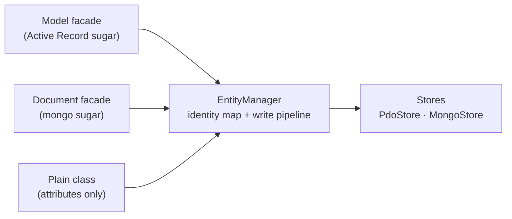

# Models & ORM

**Work with database records as objects** - Discover Azera's Active Record implementation for elegant database interactions. Learn about model configuration, static query helpers, CRUD operations, relations with eager loading, state tracking, and read/write connections.

Azera models use an Active Record style API backed by the
`Azera\Orm\EntityManager` (identity map + write pipeline). `Model` and
`Document` are thin facades over it — and because the `#[Entity]` /
`#[Column]` attributes carry the configuration, the EntityManager alone
is also a complete persistence API. See
[Two Ways to the Same Pipeline](#two-ways-to-the-same-pipeline) below for
the side-by-side comparison and the EM-direct usage.

---

## Define a Model

Extend `Azera\Orm\Model` and declare public properties for your table columns. No registration or mapping is needed — Azera infers the table name from the class name automatically.

```php
<?php
namespace App\Models;

use Azera\Orm\Model;

class User extends Model
{
    public int $id;
    public string $username;
    public string $email;
    public string $status = 'active';
}
```

### Declarative Attributes

All model configuration can be declared with attributes, compiled once into
cached metadata:

```php
use Azera\Orm\Attribute\Column;
use Azera\Orm\Attribute\Connection;
use Azera\Orm\Attribute\Entity;

#[Entity(name: 'admin_users', schema: 'sales')]
#[Connection(read: 'replica', write: 'primary')]
class AdminUser
{
    #[Column(type: 'int', pk: true)]
    public $tenant_id;

    #[Column(type: 'int', pk: true)]
    public $user_id;   // composite key = multiple pk marks

    #[Column(name: 'status_code', type: 'int', pk: false)]
    public $status;    // renamed column excluded from the key
}
```

| Attribute                                                | Applies to             | Purpose                       |
| -------------------------------------------------------- | ---------------------- | ----------------------------- |
| `#[Entity(name:, store:, schema:)]`                      | Any persistent class   | Data location + store routing |
| `#[Connection(role:)]` or `#[Connection(read:, write:)]` | Borrowing stores (SQL) | Read/write connection roles   |
| `#[Column(type:, name:, nullable:, transient:, pk:)]`    | Any persistent class   | Column configuration          |

`#[Entity(store: …)]` routes the class to the registered store of that
name (`$em->setStore('mongo', …)`) — `'sql'` is the zero-config default.
Attribute validity is decided per STORE: e.g. `#[Connection]` on a mongo
document throws during metadata compile (MongoStore owns its connections
— multiple clients = multiple store types, selected via `store:`), while
SQL stores honor it as per-class read/write routing.

### Column Type Inference

`#[Column]` is fully optional. When `type:` is omitted, the column type
is inferred from the property's PHP type — even when the attribute is
present for other reasons (renaming, `pk` marks):

```php
class AdminUser extends Model
{
    #[Column(pk: true)]
    public int $tenant_id;   // type inferred → 'int'

    #[Column(name: 'status_code', pk: false)]
    public int $status;      // renamed + excluded from key, type still 'int'
}
```

| PHP type                         | Inferred column type |
| -------------------------------- | -------------------- |
| `int`                            | `int`                |
| `float`                          | `float`              |
| `bool`                           | `bool`               |
| `array`                          | `json`               |
| `DateTime` / `DateTimeImmutable` | `datetime`           |
| anything else / untyped          | `string`             |

Pass `type:` explicitly to override the inference (e.g. `'pgarray'` for a
native pg array column, or a custom registered cast).

### Column Casts (value transformation)

Values with a registered cast type are **encoded before every write** and
**decoded after every read** — the entity property holds the PHP value,
storage holds the raw store representation:

```php
class Article extends Model
{
    /** Portable default (inferred from `array`): JSON in a text/json column. */
    public array $tags;

    /** pg native array column — declared, because inference can't know the schema. */
    #[Column(type: 'pgarray')]
    public array $labels;
}
```

| Type       | Decode (read)                                           | Encode (write)                                              |
| ---------- | ------------------------------------------------------- | ----------------------------------------------------------- |
| `int`      | `"5"` → `5` (stringifying drivers return strings)       | passthrough                                                 |
| `float`    | `"4.5"` → `4.5`                                         | passthrough                                                 |
| `bool`     | `'1'`/`'t'`/`'true'` → `true`, unknown → throw          | passthrough                                                 |
| `json`     | JSON text → array (assoc), invalid → throw              | `json_encode`, scalars pass through                         |
| `pgarray`  | pg array literal → scalar array (nested → nested)       | pg literal, nested supported, >6 dims → throw               |
| `datetime` | datetime text → `DateTimeImmutable`, unparsable → throw | `DateTimeInterface` → `'Y-m-d H:i:s'`, strings pass through |

Why the scalar casts exist: `pdo_mysql` (emulated prepares) and
`pdo_pgsql` return numerics as strings. Without them the typed property
coerces to `int` while the heap snapshot keeps `"5"` — diffing compares
`int(5) !== "5"` and the first persist of an unchanged entity schedules a
phantom UPDATE per numeric column. The casts coerce **both** the property
and the snapshot so diff compares like with like.

Custom types — implement `Azera\Orm\Casting\Cast` (encode/decode) and
register before first use:

```php
Azera\Orm\Casting\Casts::register('encrypted', new EncryptedCast());
```

Register before the first `Metadata::for()` of the affected class (or call
`Metadata::clear()` after) — the decode plan is compiled per class.

Semantics: the snapshot (`node->data`) always holds the **store
representation** (encoded strings) so the diff engine compares stable
scalars; `dirtyData()` therefore returns encoded values too. The
`datetime` decode puts a
`DateTimeImmutable` on the entity; to keep strings (or use a mutable
`DateTime` / Carbon), **replace** the registration:

```php
Azera\Orm\Casting\Casts::register('datetime', new MyDateTimeCast());
```

### Cast control per column (#\[Column(cast:)])

Every column resolves a cast policy at compile time — the ONE authority
both write and read paths consult:

- **`cast: null` (default, AUTO)** — the class's STORE decides. Stores
  declare wire formats they own natively via the `castExclusions`
  metadata key contributed in `enrichMetadata()`. MongoStore excludes
  `'json'`, `'datetime'` (BSON maps PHP arrays and
  `DateTimeInterface` itself); SQL excludes nothing. Scalar casts
  (`int`/`float`/`bool`) and custom casts stay ACTIVE on mongo — their
  decode is a no-op on native BSON values.
- **`cast: true` (FORCE)** — apply the cast even where the store excluded
  it: a mongo `json` column then stores a JSON **text** string instead of
  a BSON array (cross-backend parity), a `datetime` column a formatted
  string instead of a BSON date.
- **`cast: false` (SUPPRESS)** — raw pass-through both directions, even on
  SQL: no encode on write, no decode on read, the snapshot keeps raw
  values. Use it for columns another tool owns (hand-written JSON), or to
  say "don't touch my identity" (e.g. a mongo `_id` carrying ObjectId
  strings under a numeric-declared type).

```php
class Article extends Document
{
    #[Column(cast: false)]
    public $_id;              // mongo identity — ObjectId string, never decoded

    #[Column(type: 'json')]
    public $tags;             // AUTO: raw on mongo (BSON), JSON text on SQL

    #[Column(type: 'json', cast: true)]
    public $config;           // FORCE: JSON text even on mongo
}
```

Third-party stores adopt the same convention: contribute
`$meta['castExclusions'] = ['json', …]` in `Store::enrichMetadata()` for
every type whose registered cast your wire format makes redundant.

### Mongo Documents (MongoStore)

`#[Entity(store: 'mongo')]` classes always route to MongoDB. The stack is two layers:

- **ext-mongodb** (PECL) is the driver (wire protocol, BSON) and
- **mongodb/mongodb** (composer) is the PHP API on top of it.

```php
use Azera\Orm\Attribute\Column;
use Azera\Orm\Attribute\Entity;
use Azera\Orm\Storage\MongoStore;
use MongoDB\Client;

#[Entity(store: 'mongo', name: 'articles')]
class Article extends Document
{
    #[Column(cast: false)]
    public $_id;              // mongo's PK; ObjectId string after insert — never decoded
    public $title;
    #[Column(type: 'json')]
    public $tags;             // AUTO: raw pass-through — BSON owns encoding
}

// bootstrap: register the mongo store under its type name
$client = new Client('mongodb://localhost:27017');
AppContext::instance()->entityManager()
    ->setStore('mongo', new MongoStore($client, database: 'myapp'));

$article = new Article();
$article->title = 'Hello';
$article->tags  = ['php', 'mongo'];
$article->save();                 // INSERT — driver-generated ObjectId backfills _id

$found  = Article::find($article->_id);  // EM find → heap identity
$found->title = 'Edited';
$found->save();                   // $set diff UPDATE (only changed fields)
$found->delete();                 // deleteOne by _id
```

| Piece           | Contract                                                                                                                                 |
| --------------- | ---------------------------------------------------------------------------------------------------------------------------------------- |
| Collection name | `#[Entity(name:)]` (the generic `source`) — falls back to the snake/plural convention                                                    |
| Primary key     | `_id`; omitted at insert = driver-generated ObjectId, backfilled as string                                                               |
| `_id` filters   | the store casts 24-hex-char string `_id`s back to ObjectId automatically                                                                 |
| Values          | `json`/`datetime`/`pgarray` excluded by default (BSON owns encoding) — `#[Column(cast: true)]` forces, `cast: false` suppresses anywhere |
| Transactions    | begin/commit/rollback are no-ops (multi-doc ACID needs replica-set sessions — deferred)                                                  |

Store routing is keyed **per type name** (one axis, no roles): a document
resolves only the store registered under its `#[Entity(store:)]` name, so
it can never fall into the SQL `PdoStore` and vice versa. Multiple mongo
clients = multiple registered types (`setStore('mongo-eu', …)`,
`setStore('mongo-us', …)`) selected per class. A class whose store type
has no registration throws loudly instead of silently writing the wrong
backend.

**Primary keys:** a declared `idFields()` override is the authority. Without
one, explicit `#[Column(pk: true)]` marks define the key (composite = several
marks); the residual default is `['id']`. A single explicit mark switches the
whole class off the `id`/`*_id` name convention, so a foreign-key-like `*_id`
column never leaks into the key.

### Overrideable Methods

The methods below remain the dynamic escape hatch — an override wins over
the corresponding attribute:

| Method              | Default                          | Purpose                      |
| ------------------- | -------------------------------- | ---------------------------- |
| `source(): string`  | `#[Entity(name)]` / convention   | Table, view, or collection   |
| `schema(): ?string` | `#[Entity(schema)]` / `null`     | Database schema (PostgreSQL) |
| `idFields(): array` | `#[Column(pk)]` marks / `['id']` | Primary key field(s)         |

```php
class OrderItem extends Model
{
    public function source(): string   { return 'order_items'; }
    public function schema(): ?string  { return 'sales'; }
    public function idFields(): array  { return ['order_id', 'product_id']; }
}
```

### Table Name Conventions

By default, class names are converted to snake_case (`AdminUser` → `admin_user`). Enable automatic pluralization globally:

```php
use Azera\Db\ModelMapping;

ModelMapping::usePluralTableNames(true);
// User → users, AdminUser → admin_users, Person → people
```

Irregular plurals (`person` → `people`) are handled. Override `source()` on any model to bypass the convention entirely.

> **Note:** Model has no `toArray()` method. Access properties directly or build an array manually: `['id' => $user->id, 'email' => $user->email]`.

### Metadata Cache

Attribute configuration compiles once into a per-process array (L1) that
survives across requests in long-running workers (RoadRunner). For
request-per-process runtimes (PHP-FPM) you can wire an **opt-in second
tier** (L2) backed by any PSR-16 cache:

```php
use Azera\Cache\Backend\ApcuCache;   // azera-cache — APCu is THE backend for L2
use Azera\Orm\Metadata;

Metadata::useCache(new ApcuCache(), ttl: 86400);
```

| Method                                  | Purpose                                                                                 |
| --------------------------------------- | --------------------------------------------------------------------------------------- |
| `Metadata::useCache($psr16, ?int $ttl)` | Enable/disable the L2 backend; `$ttl` in seconds (`null` = backend default)             |
| `Metadata::cacheSalt(?string $salt)`    | Mix a value (e.g. deploy hash) into the cache key — changing it forces a full recompile |
| `Metadata::clear()`                     | Reset L1 + delete **only** Azera's L2 keys (never the whole shared segment)             |
| `Metadata::clearL1()`                   | Reset only the per-process tier — any wired L2 stays warm (fresh-worker simulation)     |

```php
// Recommended: tie entries to a deploy so changed model code recompiles
Metadata::cacheSalt($_ENV['DEPLOY_HASH']);
```

> **Important:** once an L2 backend is wired, invalidating it is your
> responsibility — shared cache stores outlive code deploys. Use a
> `cacheSalt()` deploy hash, a TTL, or `Metadata::clear()` on deploy.
> Without a backend there is no L2 at all, and metadata is always
> compiled fresh per process (always correct, microsecond cost).
>
> Measured cost on PHP 8.3, localhost (per compiled model, see
> `benchmarks/metadata-l2-cache.php` — run with `composer bench:metadata-l2`):
>
> | Path | µs/model | vs recompile |
> |---|---|---|
> | warm L1 (no L2) | 0.10 | — |
> | APCu L2 hit | 2.9 | **2.8× faster** |
> | Redis L2 hit (localhost) | 262 | 31.6× slower |
> | File L2 hit | 122 | 14.7× slower |
> | fresh reflection compile | 8.3 | baseline |
>
> **L2 is an APCu-only feature in practice.** A networked or disk
> backend loses to a reflection recompile by an order of magnitude or
> more — the metadata payload is tiny (a few hundred bytes), so the
> round-trip cost dwarfs the compile. Reflection reads attributes from
> the already-resident class tables; it never touches the network. Only
> wire a networked backend if per-class compile cost is irrelevant but
> you must share metadata across many hosts (rare — models are
> per-deploy code, not shared state).

---

## Query Builder

`Model::query()` returns a `Query` builder pre-scoped to the model's table and read connection. Use it for anything beyond simple lookups.

```php
// Optional table alias
$activeUsers = User::query('u')
    ->where('u.status', 'active')
    ->orderBy('u.created_at DESC')
    ->limit(20)
    ->select();
```

See [Database Queries](05-DATABASE-QUERIES.md) for the full query builder API.

---

## Static Load Helpers

All static helpers return fully hydrated model instances with state tracking already established.

```php
$user  = User::find(123);                           // ?static by primary key
$user  = User::findOrFail(123);                     // static or throws RuntimeException
$user  = User::findOne(['email' => $email]);        // ?static, first match
$users = User::findAll(['status' => 'active']);     // list<static>

$exists = User::exists(['email' => $email]);        // bool
$count  = User::count(['status' => 'active']);      // int
```

All loads go through the `EntityManager`'s identity map: the same row read
twice in one request returns the SAME instance, and loads establish the
heap baseline for change detection.

### Composite Keys

```php
// Positional (order matches idFields())
$item = UserProduct::find([10, 25]);

// Named (safer, order-independent)
$item = UserProduct::find(['user_id' => 10, 'product_id' => 25]);
```

When inserting a model with composite keys, any ID fields that are left unset are
backfilled automatically from the database where the server supports `RETURNING`
(PostgreSQL, MySQL 8.0.27+, MariaDB 10.5.0+, SQLite 3.35+). On older MySQL/MariaDB/SQLite
servers, only a single auto-increment ID field can be backfilled via `lastInsertId()`;
the remaining composite key fields must be set manually before saving.

---

## Relations & Eager Loading

Relations are declared as attributes on typed properties. The property name
is the relation name used with `with()`:

```php
use Azera\Orm\Attribute\BelongsTo;
use Azera\Orm\Attribute\HasMany;
use Azera\Orm\Attribute\HasOne;

class Article extends Model
{
    public int $id;
    public string $title;

    #[BelongsTo(target: User::class)]          // FK on THIS table: author_id
    public ?User $author;

    #[HasOne(target: ArticleMeta::class)]      // FK on TARGET table: article_id
    public ?ArticleMeta $meta;

    #[HasMany(target: Comment::class)]         // FK on TARGET table: article_id
    public array $comments;
}
```

| Attribute   | FK location        | Defaults                                                                |
| ----------- | ------------------ | ----------------------------------------------------------------------- |
| `BelongsTo` | this model's table | `foreignKey` = property name + `_id`, `ownerKey` = target's primary key |
| `HasOne`    | target table       | `foreignKey` = `<source>_id`, `ownerKey` = `id`                         |
| `HasMany`   | target table       | same as `HasOne`                                                        |

All three accept explicit `foreignKey:` / `ownerKey:` parameters to override
the conventions.

### Eager loading — `with()`

```php
// One SQL for root + to-one joins, one extra query per HasMany
$articles = Article::with('author', 'comments')
    ->where('status', 'published')
    ->orderBy('id DESC')
    ->limit(10)
    ->entities();

$articles[0]->author->name;   // User instance — hydrated from the LEFT JOIN
$articles[0]->comments;       // list<Comment> — batched second query
```

| Relation               | Strategy        | How it loads                                                                                              |
| ---------------------- | --------------- | --------------------------------------------------------------------------------------------------------- |
| `BelongsTo` / `HasOne` | SQL `LEFT JOIN` | One query — joined columns are aliased `{alias}__{column}` and split back into entities per row           |
| `HasMany`              | second query    | One batched `WHERE fk IN (root ids)` per relation — joining would duplicate parent rows, so it never does |

The joined query honors all builder clauses (WHERE / ORDER BY / LIMIT /
GROUP BY): criteria apply to the root table, never to the joined rows.

Identity: every entity — root and related — hydrates onto the request-scoped
heap, so joined entities share instances with `find()` / `save()`. A `User`
joined as `author` and later loaded via `User::find()` is the SAME object.

> **Note:** there is no lazy loading. Relation properties are populated only
> when eager-loaded via `with()`; on entities loaded without it the property
> stays unset. `find()` / `findOne()` never carry relations — use
> `query()->with(...)->firstEntity()` when you need them.

---

## Creating Records

### `create()` — insert and return

```php
$user = User::create([
    'username' => 'alice',
    'email'    => 'alice@example.com',
]);
// $user->id is populated after insert (auto-increment or RETURNING)
```

### `forceCreate()` — bypass ID guards

Removed. Use `upsert()` (atomic INSERT ... ON CONFLICT DO UPDATE) when you
control the data, or `create()` when you don't.

### `upsert()` — atomic create-or-update

```php
User::upsert(['id' => 7, 'username' => 'renna', 'email' => 'r@example.com']);
```

One `INSERT ... ON CONFLICT (id) DO UPDATE SET` statement — the DATABASE
decides insert vs update at write time (no SELECT, no unique-violation
race under concurrency). All ID fields must be present (they form the
conflict target); on conflict, all non-ID fields are updated.

Routed through the EntityManager: the model lands in the identity map
(`User::find(7)` returns the same instance afterwards) and the statement
joins any open flush transaction. The `DO UPDATE SET` writes non-ID
columns only, as `EXCLUDED` references — the fastest shape on SQLite
(including the PK in SET forces an internal DELETE+INSERT there).

### `firstOrCreate()` — find or insert

```php
$user = User::firstOrCreate(
    ['email' => 'john@example.com'],   // conditions to find by
    ['username' => 'john']              // extra values if creating
);
```

### `updateOrCreate()` — find, update or insert

```php
$user = User::updateOrCreate(
    ['email' => 'john@example.com'],   // conditions to find by
    ['username' => 'johnny']            // values to set on update or merge on create
);
```

---

## Saving Changes

### `save()` — smart INSERT or UPDATE

`save()` inspects the model's state and decides automatically:

- If **all ID fields are set** → `UPDATE` (only changed fields are sent)
- If **any ID field is missing** → `INSERT`

Returns `false` when there is nothing to save (no changes detected).

```php
$user = User::find(123);
$user->email = 'new@example.com';
$user->save(); // UPDATE users SET email = ? WHERE id = 123
```

```php
$user = new User();
$user->username = 'bob';
$user->email = 'bob@example.com';
$user->save(); // INSERT INTO users ...
// $user->id is set after insert
```

### `insert()` / `update()` — removed

Removed in favor of ONE write pipeline: `save()` (diff INSERT or UPDATE
through the EntityManager) and `upsert()` (single atomic
INSERT ... ON CONFLICT DO UPDATE statement, also through the
EntityManager).

### `delete()`

```php
$user->delete(); // DELETE FROM users WHERE id = ?
```

### `flush()` — single-connection atomic flush

`save()` persists through the EntityManager and flushes with the CURRENT
flush cycle — every write lands in ONE transaction on ONE connection
target: all scheduled classes must resolve to one store instance AND one
connection target on it, otherwise the flush spans two connections and
throws (a cross-connection transaction does not exist):

```php
$em->flush();  // or simply Model::save() — same write pipeline
```

The error names the two targets and the escape hatch — persist through
separate EntityManagers, split the flush, or use `flushAll()` below.

### `flushAll()` — multi-connection flush

When a write set legitimately spans connections (SQL + mongo, or several
`#[Connection(write: …)]` roles on one store), `flushAll()` executes the
whole scheduled set across EVERY target:

```php
$em->flushAll();   // Model: AppContext::instance()->entityManager()->flushAll()
```

| Piece           | `flush()`                     | `flushAll()`                                                                               |
| --------------- | ----------------------------- | ------------------------------------------------------------------------------------------ |
| Transactions    | ONE tx, ONE connection target | one tx per store/connection target, begun lazily                                           |
| Execution order | single topological pass       | single topological pass ACROSS all targets (FK backfill crosses groups)                    |
| Commits         | at the end of the pass        | deferred until every node executed                                                         |
| Failure         | full rollback                 | all txs begun SO FAR roll back; already-committed groups stay (best-effort all-or-nothing) |
| Multi-target    | throws                        | works                                                                                      |

Cross-connection atomicity does not exist anywhere (two-phase commit is
not modeled) — `flushAll()` trades strict atomicity for reachability,
matching `flush()`'s failure shape as closely as physically possible.
Prefer `flush()` when the whole write set shares one connection target.

Two store/connection facts worth knowing:

- **Role aliases collapse.** Two `#[Connection(write: …)]` roles that
  resolve to the SAME `Database` share ONE transaction (one `BEGIN`) —
  same connection, same tx, atomically coupled by the database itself.
- **A tx pins only its own target.** Reads on the transaction's
  connection see its uncommitted writes; reads resolving to OTHER
  connections run autocommit (a tx no longer hijacks unrelated
  roles' traffic).

---

## State Tracking

Every model loaded through a static helper is heap-tracked by the
`EntityManager` — the node snapshot doubles as the diff baseline.

| Method          | Description                                        |
| --------------- | -------------------------------------------------- |
| `hasChanged()`  | `true` if any field differs from the heap baseline |
| `changedData()` | Field-name-keyed map of changed values             |
| `loadState()`   | Restore all fields to the heap baseline            |

```php
$user = User::find(123);         // heap-tracked with baseline
$user->email = 'new@example.com';

$user->hasChanged();             // true
$user->changedData();            // ['email' => 'new@example.com']

$user->loadState();              // revert to baseline
$user->hasChanged();             // false

$user->email = 'other@example.com';
if ($user->hasChanged()) {
    $user->save();               // UPDATE only the changed fields
}
```

The ORM tracks only the columns declared via metadata (public properties /
`#[Column]` attributes); properties that are not part of the model's
metadata are ignored by change detection and writes.

---

## Two Ways to the Same Pipeline

Every facade call shown above — `find()`, `save()`, `upsert()`,
`delete()` — delegates to ONE request-scoped `EntityManager`: identity
map → diff → transaction → ID backfill. `Model` and `Document` are thin
**facades** over it (Active Record sugar), and the `#[Entity]` /
`#[Column]` attributes are the **metadata source** for every style.
Because the attributes alone are enough, the base class is optional: a
plain class plus the EM is a fully supported persistence path.



```php
use Azera\AppContext;
use Azera\Orm\Attribute\Column;
use Azera\Orm\Attribute\Entity;

// No base class: the attributes carry ALL configuration,
// the EntityManager carries ALL behavior.
#[Entity(name: 'sessions')]
class Session
{
    #[Column(pk: true)]
    public int $id;
    public string $token;
    public ?string $user_agent;
}

$em = AppContext::instance()->entityManager();

// LOAD — through the identity map (the heap hit returns the SAME instance)
$session = $em->find(Session::class, ['id' => 7]);

// MUTATE — tracked entity, diffed against the heap snapshot
$em->isDirty($session);      // false
$session->token = 'rotated';
$em->isDirty($session);      // true
$em->dirtyData($session);    // ['token' => 'rotated']

// SAVE — persist() schedules, flush() writes ONLY the changed fields
$em->persist($session)->flush();   // UPDATE sessions SET token = ? WHERE id = 7

// INSERT — persist an untracked entity; the flush backfills the generated id
$new = new Session();
$new->token = 'fresh';
$em->persist($new)->flush();       // $new->id is populated after flush

// DELETE
$em->remove($session)->flush();

// Atomic create-or-update (same statement Model::upsert() emits; full PK required)
$em->upsert($new)->flush();

// Manually built entity with a full identity, loaded OUTSIDE the EM:
// adopt() registers it as managed with an EMPTY baseline — the next
// flush writes every set column (the same semantic $model->save() uses).
$em->adopt($detached);
$em->persist($detached)->flush();
```

The unit-of-work shape the facades do not expose directly: many changes,
one flush, one transaction.

```php
$em->persist($a)->persist($b)->persist($c)->flush();
```

Flush semantics for these writes (single-connection atomicity and the
`flushAll()` escape hatch) are documented under
[Saving Changes](#saving-changes).

### Which style to use

| Task                     | With `Model` / `Document`       | Plain class + EM                                    |
| ------------------------ | ------------------------------- | --------------------------------------------------- |
| Load by PK               | `Session::find(7)`              | `$em->find(Session::class, ['id' => 7])`            |
| Load by conditions       | `Session::findOne([...])`       | `$em->findBy(Session::class, [...])[0]`             |
| Insert / update          | `$session->save()`              | `$em->persist($s)->flush()`                         |
| Upsert                   | `Session::upsert([...])`        | `$em->upsert($s)->flush()`                          |
| Delete                   | `$session->delete()`            | `$em->remove($s)->flush()`                          |
| Dirty check / revert     | `hasChanged()` / `loadState()`  | `$em->isDirty($s)` / `$em->revert($s)`              |
| Re-read in place         | `Session::find(7, fresh: true)` | `$em->refresh($s)`                                  |
| Query builder → entities | `Session::query()->entities()`  | not available — read via `$em->find()` / `findBy()` |

Guidance:

- **Facades** are the ergonomic default: static finders, `save()` /
  `firstOrCreate()`, eager loading via `with()`, and query-builder
  hydration (`entities()` requires a `Model` subclass).
- **Plain class + EM** gives you lean domain objects with no inherited API
  surface and full unit-of-work control (batch several `persist()` calls
  into ONE atomic `flush()`). It also frees the class to extend something
  else — inheritance is never consumed by persistence. Instances carry no
  per-entity state in either style (identity + snapshots live in the
  request-scoped heap), so the savings are in the class surface, not the
  heap.
- The same split applies to documents: `#[Entity(store: 'mongo')]` +
  `$em->persist()/flush()` replaces the `Document` base class.
- PK resolution differs slightly: explicit `#[Column(pk: true)]` marks work
  on any class; on plain classes the `id` / `*_id` naming convention also
  contributes the key, while `Model` classes default to `['id']`.

> **Note:** facade-style and EM-direct use share ONE identity map — an
> entity loaded via `Session::find()` and the same row loaded via
> `$em->find()` are the SAME object in the same request.

---

## Read/Write Connections

Connections are managed by `DatabaseManager` using named **roles**. Register them in your bootstrap:

```php
use Azera\AppContext;
use Azera\Db\Database;

$mgr = AppContext::instance()->dbManager();
$mgr->set('write', new Database('mysql:host=primary;dbname=myapp', 'rw', 'secret'));
$mgr->set('read',  fn() => new Database('mysql:host=replica;dbname=myapp', 'ro', 'secret'));
```

By default all models read from the `read` role and write to the `write` role, falling back to the registered default when a role is absent.

### Per-model role overrides

Static config: put `#[Connection]` on the class — it sits above the
base-model global override and below runtime setters:

```php
use Azera\Orm\Attribute\Connection;

#[Connection('analytics')]                         // read + write
#[Connection(read: 'replica', write: 'primary')]   // split routing
class User extends Model { ... }
```

Runtime config (per-request tenancy etc.) beats the attribute:

```php
// Both read and write to the same custom role
User::setDefaultRole('analytics');

// Fine-grained
User::setDefaultReadRole('replica');
User::setDefaultWriteRole('primary');
```

### Global override (all models)

Call `setDefaultRole()` on the base `Model` class to change the default for every model that has not set its own role or `#[Connection]` attribute:

```php
use Azera\Orm\Model;

Model::setDefaultRole('default'); // reset everything to 'default'
```

### Single-database setup

Register one connection under any name — all models fall through to it:

```php
AppContext::instance()->dbManager()->set('default', new Database(...));
```

### Direct connection access

```php
$db = $user->readConnection();   // Database (read role)
$db = $user->writeConnection();  // Database (write role)
```

## Using ModelMapping Without Model Classes

`ModelMapping` lets you query the database using logical model names without defining PHP model classes. This is useful for rapid prototyping, dynamic table mappings, or when you need query-builder convenience for tables that don't warrant a full Active Record class.

In the new resolver system, a `MappingResolver` wraps the mapping and is registered in `AppContext` (typically as part of a `ChainResolver` alongside a `ModelResolver`).

### Register a mapping

```php
use Azera\AppContext;
use Azera\Db\ModelMapping;
use Azera\Db\Resolver\ChainResolver;
use Azera\Db\Resolver\MappingResolver;
use Azera\Db\Resolver\ModelResolver;
use Azera\Db\Resolver\TableResolver;

$mapping = ModelMapping::fromArray([
    // simple: name => table
    'User'    => 'users',
    // explicit, no schema:
    'Product' => ['source' => 'products'],
    // explicit with schema:
    'Order'   => ['source' => 'orders', 'schema' => 'public'],
    // with a connection role (read + write):
    'Log'     => ['source' => 'logs', 'connection' => 'logging'],
    // with separate read/write connections:
    'Stat'    => ['source' => 'stats', 'read' => 'replica', 'write' => 'primary'],
]);

// Register as the AppContext default so Query::new() picks it up
AppContext::instance()->set(TableResolver::class, new ChainResolver(
    new ModelResolver(),
    new MappingResolver($mapping),
));
```

Once registered, use the logical name wherever `Query` accepts a table or model reference:

```php
// Query::new() uses the AppContext default resolver (the chain above)
$results = Query::new()
    ->table('User')
    ->where('status', 'active')
    ->select();

// Joins also use logical names
$results = Query::new()
    ->table('User')
    ->join('Order', Condition::new()->where('User.id = Order.user_id'))
    ->columns(['User.id', 'User.email', 'Order.total'])
    ->select();
```

For a one-off mapping without registering globally, use `Query::using()`:

```php
use Azera\Db\Resolver\MappingResolver;

$results = Query::new()
    ->using(new MappingResolver($mapping))
    ->table('User')
    ->select();
```

### Auto-generated table names

Pass `true` as the value to let `ModelMapping` derive the table name automatically from the model name (snake_case, or pluralized when `usePluralTableNames` is enabled):

```php
ModelMapping::usePluralTableNames(true); // User → users, AdminUser → admin_users

$mapping = ModelMapping::fromArray([
    'User'    => true,  // auto: "users"
    'Product' => true,  // auto: "products"
]);
```

### Fluent builder

Use the `add()` method to build mappings programmatically:

```php
$mapping = (new ModelMapping())
    ->add('User', 'users')
    ->add('Order', 'orders', 'public')           // third arg is the schema
    ->add('Log', 'logs', null, 'logging')         // fourth arg is connection (read+write)
    ->add('Stat', 'stats', null, null, 'replica', 'primary'); // read, write overrides
```

### Connection roles

Each mapping entry can specify connection roles:

- `connection` — sets both read and write to the same role
- `read` — overrides the read connection role
- `write` — overrides the write connection role

When `read`/`write` are set, they take precedence over `connection`.

> **Note:** `ModelMapping` only affects `Query`-level operations. The Active Record helpers (`User::find()`, `User::create()`, etc.) still require a PHP class that extends `Model`.

## Related

- [Database Queries](05-DATABASE-QUERIES.md)
- [Cookbook](11-COOKBOOK.md)
- [API Reference](api/README.md)
