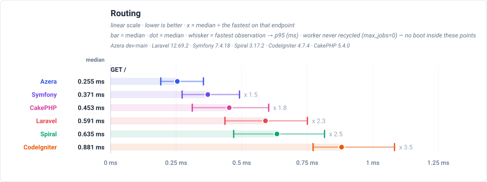
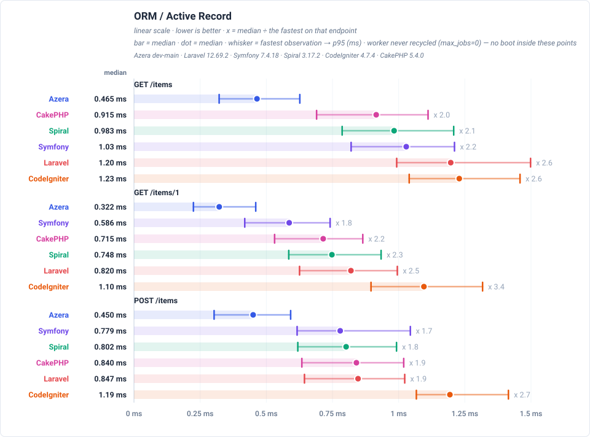
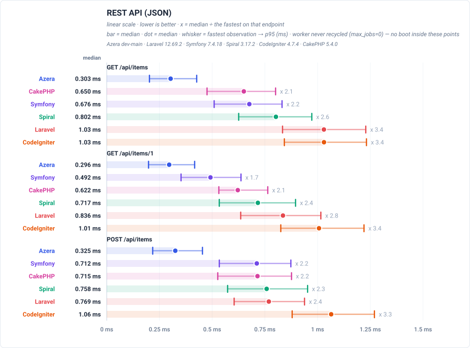
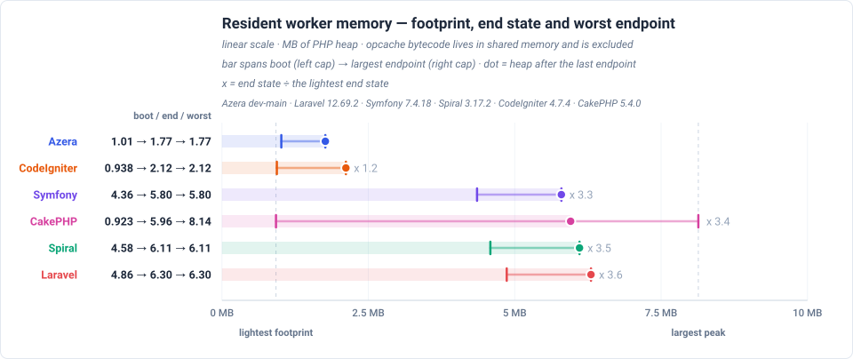

# Framework Competition — RoadRunner Summary

This summary covers a resident RoadRunner worker. Requests were measured over
HTTP loopback, so the results include server overhead; the server floor below
shows that cost.

**Environment** — PHP 8.3.33 · Linux 6.8.0-139-generic · OPcache: yes · 1000 iterations per run over 10 runs, lower is better.

**Frameworks** — Azera dev-main (v0.1.0) · Laravel 12.69.2 · Symfony 7.4.18 · Spiral 3.17.2 · CodeIgniter 4.7.4 · CakePHP 5.4.0.

_Measured 2026-09-29T12:55:05+00:00_

## Total response times

Each total is the sum of a framework's median times across all endpoints, not
a single request time. The chart compares totals with the baseline. Endpoint
medians exclude the worker's one-time startup.

## Feature benchmarks

Each chart compares a real request for one feature against a live database.
The heading names the endpoint and workload.

### Routing
 `GET /` — dispatches a plain request through the router and returns a rendered template — no database access.

### ORM / Active Record
 `GET /items` — loads one page of the 1,000 seeded rows through each framework's ORM / Active Record layer: 20 items plus a COUNT for the pagination total.

### REST API (JSON)
 `GET /api/items` — serves the same page of items as a JSON response rather than HTML, which adds serialization to the ORM work.

## Resident worker memory

Memory is read inside the live worker after each endpoint, using an extra
untimed request. All frameworks share one MB axis. The **left cap** is the
booted heap before requests (OPcache is excluded), the **dot** is the heap
after the final endpoint, and the **right cap** is the peak heap.

The numbers are read from the resident RoadRunner worker, which answers them directly in response headers.

Rows are ordered by the **dot**, which shows memory retained after the final
endpoint. The multiplier compares each dot with the lowest one. A low left cap
and high dot indicate a framework that is cheap to boot but retains more memory.

The dot and right cap depend on endpoint order because the probe reads the
whole heap, not per-request allocations. Treat the range as worker growth over
this run, not as the memory cost of one request.

## Latency by endpoint

Trimmed mean per request in milliseconds; lower is better and **bold** marks
the fastest result. Timings exclude worker startup but include HTTP server
overhead. All frameworks use the same seeded database and page size; the
workload column shows what varies.

The worker is not recycled during the run (`max_jobs=0`). See the full report
for recycle costs and pool-sizing details.

**Server floor** — `floor-rr` measures the IPC and RoadRunner overhead by
rendering a fixed string. Every row includes this floor; differences above it
reflect the frameworks.

| Request | Workload | Azera | Laravel | Symfony | Spiral | CodeIgniter | CakePHP |
|---|---|---:|---:|---:|---:|---:|---:|
| `GET /` | no DB — routing + template only | **0.264** | 0.608 | 0.382 | 0.653 | 0.906 | 0.476 |
| `GET /items` | 20 of 1000 items (page 1, + COUNT) | **0.478** | 1.23 | 1.05 | 1.01 | 1.26 | 0.955 |
| `GET /items/1` | 1 item by id | **0.335** | 0.836 | 0.604 | 0.759 | 1.12 | 0.742 |
| `POST /items` | 1 row upserted (sentinel #999999) | **0.464** | 0.863 | 0.792 | 0.812 | 1.22 | 0.867 |
| `GET /items-qb` | 20 of 1000 items (page 1, + COUNT) | **0.422** | 0.901 | 0.655 | 0.812 | 1.23 | 0.745 |
| `GET /items-qb/1` | 1 item by id | **0.355** | 0.755 | 0.545 | 0.711 | 1.11 | 0.648 |
| `POST /items-qb` | 1 row upserted (sentinel #999997) | **0.397** | 0.854 | 0.693 | 0.795 | 1.33 | 0.748 |
| `GET /api/items` | 20 of 1000 items as JSON | **0.319** | 1.04 | 0.689 | 0.815 | 1.05 | 0.676 |
| `GET /api/items/1` | 1 item by id as JSON | **0.309** | 0.851 | 0.499 | 0.735 | 1.03 | 0.644 |
| `POST /api/items` | 1 row upserted (sentinel #999998) | **0.341** | 0.787 | 0.733 | 0.782 | 1.08 | 0.730 |
| `GET /features/aop` | no DB — interceptor pipeline | **0.459** | 0.744 | 0.615 | 0.946 | — | — |
| `GET /features/cache` | COUNT(*) of 1000 rows, cached 10s (miss = query) | **0.246** | 0.594 | 0.361 | 0.693 | 0.790 | 0.379 |
| `GET /features/log` | no DB — buffered log handlers | **0.242** | 0.536 | 0.363 | 0.687 | — | — |
| `GET /features/retry` | no DB — retry policy | **0.237** | 0.589 | 0.369 | 0.706 | — | — |
| `GET /features/pipeline` | no DB — middleware pipeline | **0.241** | 0.586 | 0.353 | 0.695 | — | — |
| `GET /features/db-events` | 1 event row INSERTed per request | **0.325** | 0.838 | 0.608 | 0.944 | 1.21 | 0.670 |
| `GET /features/events` | no DB — in-process listeners | **0.298** | 0.728 | 0.439 | 0.781 | 1.16 | 0.569 |
| `GET /features/validation` | no DB — validator run | **0.244** | 1.29 | 0.563 | 0.711 | 1.13 | 0.515 |
| `GET /features/config` | no DB — config lookup | **0.223** | 0.583 | 0.378 | 0.661 | 0.824 | 0.361 |
| `GET /features/request-scoped` | no DB — scoped service resolve | **0.235** | 0.569 | 0.378 | 0.700 | 0.826 | 0.365 |
| `GET /features/rate-limit` | no DB — cache-backed limiter | **0.236** | 0.596 | 0.384 | 0.705 | 0.829 | 0.385 |

**Full comparison** — this page is a summary. The complete report, with every feature chart and the endpoint table for all six frameworks, is published at:

- The complete report (all six frameworks, every feature chart) — <https://sailantis.github.io/azera-competition/benchmarks/>
- This model, measured end to end — <https://sailantis.github.io/azera-competition/benchmarks/view-real-roadrunner.html>
- The PHP-FPM summary — <https://sailantis.github.io/azera-competition/benchmarks/view-summary-fpm.html>

---

> **Auto-generated.** This page and its charts are produced by the `azera-competition` repository:
> `php run.php --apps=azera,laravel,symfony,spiral,codeigniter,cakephp --warm --cold --seed --out=results/free-for-all-opcache-iso`
> then `php scripts/derive-fpm.php results/free-for-all-opcache-iso` and `php scripts/report.php --publish=framework`. Do not edit by hand — re-run the benchmark to update it.

Every chart is a plain SVG generated from the result JSON, so the numbers and the diagrams can never disagree.
